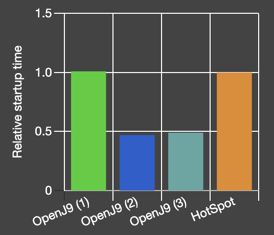
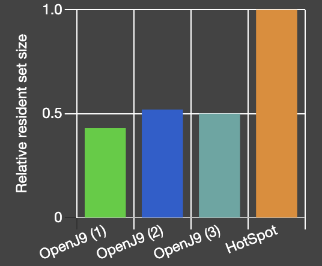
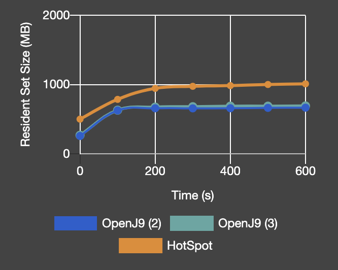
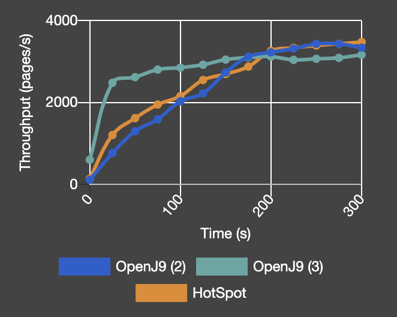

# OpenJDK 11 performance with Eclipse OpenJ9

**Our benchmark results suggest that running an application on OpenJ9 instead of HotSpot delivers reductions in footprint and startup time without sacrificing throughput.**

To evaluate the performance characteristics of OpenJ9 we used the DayTrader7 benchmark, which produced the following results:

- **51 - 55% faster startup time**

- **45 - 57% smaller startup footprint**

- **33% smaller footprint during application ramp-up**

- **Comparable throughput**

## Metrics and configurations

Because performance means different things to different people, we decided to look at multiple metrics:

**Startup time:**

Startup time is measured from the moment the VM process is invoked until the moment Liberty prints “*ready to run a smarter planet*”.

**Memory footprint after startup:**

Physical memory consumption is measured immediately after startup with the following command: `ps -orss --no-headers -–pid JvmPid.`

**Footprint during load:**

We record the physical memory consumed by the VM as load is applied to the benchmark. Memory is measured by using the following command: `ps -orss --no-headers -–pid JvmPid.`

**Ramp-up time:**

As load is applied to the system and the VM compiles more and more methods into native code, throughput improves gradually. Ramp-up time represents the time needed for throughput to reach its peak.

**Peak throughput:**

Peak throughput is defined as the number of transactions processed per second after the VM has fully 'warmed-up'.

To demonstrate the optimizations that are available in the OpenJ9 VM, we ran tests with three different configurations:

1. **OpenJ9 (1)**: No options, which represents the out-of-the-box performance. Note: By default, class data sharing is enabled for bootstrap classes only, unless your application is running in a container.
2. **OpenJ9 (2)**: OpenJ9 with shared class cache (SCC) and dynamic Ahead-of-Time (AOT) technology enabled for all classes (see [tutorial](https://developer.ibm.com/technologies/java/tutorials/j-class-sharing-openj9/)). This configuration can significantly improve startup and ramp-up of Java applications with minimal effect on throughput.
3. **OpenJ9 (3)**: OpenJ9 with SCC/AOT and `-Xtune:virtualized` enabled. The `-Xtune:virtualized` option is recommended for resource constrained environments that are typically found in the cloud. Under the hood, this option enables the generation of AOT method bodies to the full extent possible, reduces the optimizer aggressiveness, and makes recompilation of AOT bodies less likely. These actions result in lower CPU and memory consumption by the JIT compilation threads. Because DayTrader7 is a relative large application, in the throughput experiments with `-Xtune:virtualized`, we increased the size of the SCC from the default 80 MB set by Liberty to 200 MB.

With respect to heap settings we ran tests in the following modes:

- Setting only the maximum Java heap size (`-Xmx`).
- Setting the initial Java heap size (`-Xms`) and maximum Java heap size (`-Xmx`) at the same value.

## Startup time

Without an SCC, OpenJ9 and Hotspot show similar results, although OpenJ9 shows a small advantage in some configurations.
However, when we take advantage of the SCC/AOT technology, the startup time reduces considerably and OpenJ9 yields excellent improvements over HotSpot:

- 51 - 55% faster startup

On the other hand, from the graphs it is apparent that, `-Xtune:virtualized`, an option that we used to recommend for extracting the full start-up benefit of SCC/AOT, is no longer needed. This is due to recent changes in OpenJ9 compilation heuristics to generate AOT method bodies more aggressively during start-up phase and to compile those bodies at "cheap warm" optimization level (like `-Xtune:virtualized` does) instead of "cold".




## Memory footprint after startup

With respect to memory consumption, the OpenJ9 VM has always been associated with a small footprint. The results of our benchmark testing are no exception, in all the configurations tested, OpenJ9 has a clear lead over Hotspot.

- 45-57% smaller footprint after startup

The presence of the SCC and AOT increases the footprint slightly due to the addition of the cache and because AOT method code are usually slightly larger than the corresponding JIT compiled method bodies.
During the startup phase, OpenJ9 already generates AOT aggressively, so the addition of the `-Xtune:virtualized` option has little effect on footprint.




## Memory footprint during application ramp-up

Footprint during load is arguably a more important performance metric than footprint after startup. In our tests, DayTrader7 running on OpenJ9 with SCC/AOT enabled, demonstrates a 33% advantage over HotSpot
irrespective of the Java heap configuration (with or without `-Xms`).

As with the previous metrics, the `-Xtune:virtualized` option does not appear to make a difference in the long run. However, it is worth noting that, in a recent change, the maximum amount of memory a compilation thread is allowed to use in the `-Xtune:virtualized` mode has been decreased from 256 MB to 16 MB resulting in a smoother memory consumption behavior, without transient spikes that can increase peak footprint.




## Ramp-up time and peak throughput

Both OpenJ9 with SCC/AOT and HotSpot reach about the same level of peak throughput in the benchmark tests. These results suggest that by running an application on OpenJ9 instead of HotSpot, you can achieve reductions in footprint and startup time without sacrificing throughput.

With respect to throughput ramp-up, we see similar results for Open9 and HotSpot.

The configuration with `-Xtune:virtualized` ramps-up very fast in the beginning because it benefits from more methods being compiled with the dynamic AOT technology.
However, the recompilation process is subdued, and this makes OpenJ9 reach its peak throughput sooner, but at a lower level.
While both OpenJ9 with SCC/AOT and HotSpot settle for about the same peak throughput, the addition of `Xtune:virtualized` degrades peak throughput by about 10%.
Nevertheless, we think that this configuration is very well suited for short or medium running applications where the ability to startup and ramp-up fast is more important than long term throughput.



## Benchmark testing details

You can replicate these results by using equivalent systems and OpenJDK binary files.

### System under test

- desktop machine with 4-core Intel(R) Core(TM) i7-3770K CPU @ 3.50GHz
- Hyperthreading enabled
- 16GB RAM
- CentOS 7.7 operating system

### Benchmark application

Tests were performed using the DayTrader7 application, which models an online stock trading system. DayTrader7 was installed on top of [WebSphere Application Server with Java EE7 Web Profile version 20.0.0.5](https://developer.ibm.com/wasdev/downloads).
The Java process was pinned to two full cores (4 HW threads) and running directly on the operating system. Data persistence was ensured by a DB2 process running on a second machine. For throughput experiments, load was applied by using JMeter 3.3 with 50 threads, running on a third machine.

Unless otherwise specified, OpenJ9 used the default shared classes cache (SCC) size of 80 MB, which is set internally by Liberty scripts. All performance numbers with AOT enabled were collected with a SCC populated by a previous 'cold' run, which is not included in the measurements.

### OpenJDK binaries

The following binaries were obtained from [AdoptOpenJDK](https://adoptopenjdk.net/) for performance testing:

• **OpenJDK11 with OpenJ9**

```
openjdk version "11.0.8" 2020-07-14
OpenJDK Runtime Environment AdoptOpenJDK (build 11.0.8+3-202005202338)
Eclipse OpenJ9 VM AdoptOpenJDK (build master-78f76052e, JRE 11 Linux amd64-64-Bit Compressed References 20200520_616 (JIT enabled, AOT enabled)
OpenJ9   - 78f76052e
OMR      - 9456c8029
JCL      - cfce36dfff based on jdk-11.0.8+3)
```

• **OpenJDK11 with HotSpot**

```
openjdk version "11.0.7" 2020-04-14
OpenJDK Runtime Environment AdoptOpenJDK (build 11.0.7+10)
OpenJDK 64-Bit Server VM AdoptOpenJDK (build 11.0.7+10, mixed mode)
```